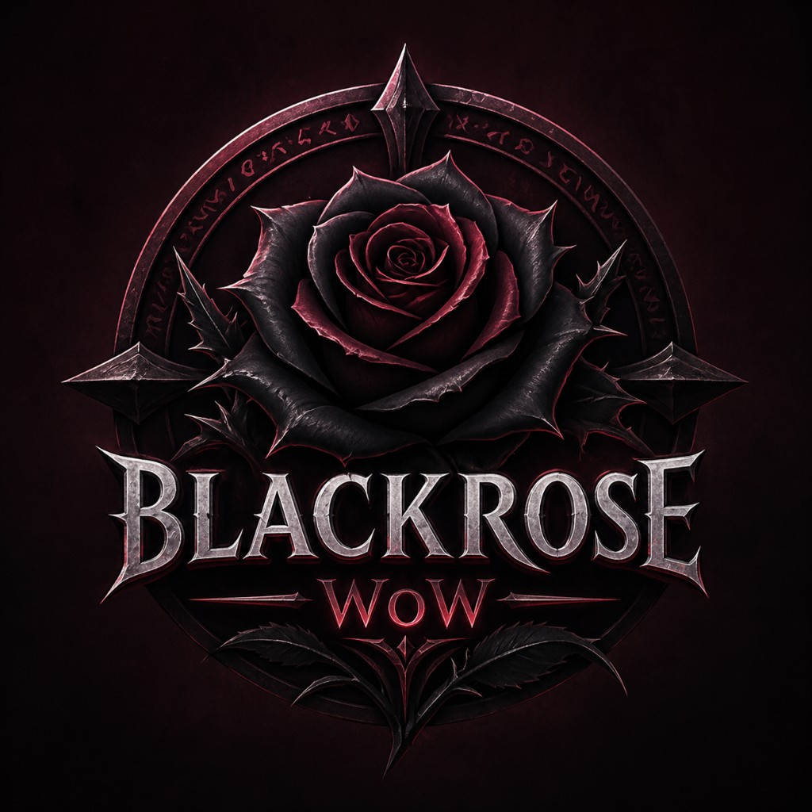

#  BlackroseWoW

BlackroseWoW is a blizzlike hardcore Wrath of the Lich King (3.3.5a) server,
built on AzerothCore, with carefully scoped custom content and stable
operations tooling.

## Documentation Tabs

- [Server Profile](SERVER_PROFILE.md)
- [Setup Instructions](SETUP.md)
- [Custom Content](CUSTOM_CONTENT.md)
- [Release Notes](RELEASE_NOTES.md)

## AzerothCore base

This project is based on
[AzerothCore](https://github.com/azerothcore/azerothcore-wotlk), an open-source
MMORPG framework for WoW 3.3.5a.

Useful upstream resources:

- [AzerothCore Website](https://www.azerothcore.org/)
- [AzerothCore Wiki](https://www.azerothcore.org/wiki)
- [AzerothCore Modules Catalogue](https://www.azerothcore.org/catalogue.html#/)
- [AzerothCore Discord](https://discord.gg/gkt4y2x)

## Credits

- BlackroseWoW customization and maintenance by the Blackrose team
- Core architecture and upstream content support by AzerothCore contributors
- Historical lineage includes MaNGOS, TrinityCore, and SunwellCore

## License

This fork remains under the upstream
[GNU GPL v2](https://www.gnu.org/licenses/old-licenses/gpl-2.0.en.html).

BlackroseWoW is not affiliated with or endorsed by Blizzard Entertainment.
