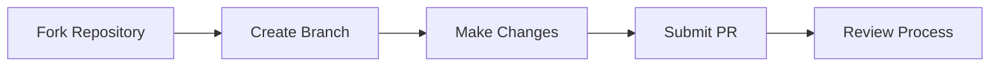

# 

*Unleash the power of Lua scripting in your AzerothCore server*

---

> [!NOTE]
> mod-eluna © is a powerful Lua scripting engine embedded into the AzerothCore emulator. We are committed to continuously improving mod-eluna for both developers and server administrators.

## 📚 Additions from Eluna/master
| Category | Method | Github |
|:---------|:-----------|:-------|
| [**RegisterPlayerEvent**](https://www.azerothcore.org/eluna/Global/RegisterPlayerEvent.html) | | |
| | [`PLAYER_EVENT_ON_PET_ADDED_TO_WORLD`](https://www.azerothcore.org/eluna/Global/RegisterPlayerEvent.html) | https://github.com/azerothcore/mod-eluna/pull/3 |
| | [`PLAYER_EVENT_ON_LEARN_SPELL`](https://www.azerothcore.org/eluna/Global/RegisterPlayerEvent.html) | https://github.com/azerothcore/mod-eluna/pull/46 |
| | [`PLAYER_ON_ACHIEVEMENT_COMPLETE`](https://www.azerothcore.org/eluna/Global/RegisterPlayerEvent.html) | https://github.com/azerothcore/mod-eluna/pull/47 |
| | [`PLAYER_EVENT_ON_FFAPVP_CHANGE`](https://www.azerothcore.org/eluna/Global/RegisterPlayerEvent.html) | https://github.com/azerothcore/mod-eluna/pull/63 |
| | [`PLAYER_EVENT_ON_UPDATE_AREA`](https://www.azerothcore.org/eluna/Global/RegisterPlayerEvent.html) | https://github.com/azerothcore/mod-eluna/pull/65 |
| | [`PLAYER_EVENT_ON_CAN_INIT_TRADE`](https://www.azerothcore.org/eluna/Global/RegisterPlayerEvent.html) | https://github.com/azerothcore/mod-eluna/pull/83 |
| | [`PLAYER_EVENT_ON_CAN_SEND_MAIL`](https://www.azerothcore.org/eluna/Global/RegisterPlayerEvent.html) | https://github.com/azerothcore/mod-eluna/pull/85 |
| | [`PLAYER_EVENT_ON_CAN_JOIN_LFG`](https://www.azerothcore.org/eluna/Global/RegisterPlayerEvent.html) | https://github.com/azerothcore/mod-eluna/pull/86 |
| | [`PLAYER_EVENT_ON_QUEST_REWARD_ITEM`](https://www.azerothcore.org/eluna/Global/RegisterPlayerEvent.html) | https://github.com/azerothcore/mod-eluna/pull/88 |
| | [`PLAYER_EVENT_ON_CREATE_ITEM`](https://www.azerothcore.org/eluna/Global/RegisterPlayerEvent.html) | https://github.com/azerothcore/mod-eluna/pull/88 |
| | [`PLAYER_EVENT_ON_STORE_NEW_ITEM`](https://www.azerothcore.org/eluna/Global/RegisterPlayerEvent.html) | https://github.com/azerothcore/mod-eluna/pull/88 |
| | [`PLAYER_EVENT_ON_COMPLETE_QUEST`](https://www.azerothcore.org/eluna/Global/RegisterPlayerEvent.html) | https://github.com/azerothcore/mod-eluna/pull/90 |
| | [`PLAYER_EVENT_ON_CAN_GROUP_INVITE`](https://www.azerothcore.org/eluna/Global/RegisterPlayerEvent.html) | https://github.com/azerothcore/mod-eluna/pull/100 |
| | [`PLAYER_EVENT_ON_GROUP_ROLL_REWARD_ITEM`](https://www.azerothcore.org/eluna/Global/RegisterPlayerEvent.html) | https://github.com/azerothcore/mod-eluna/pull/119 |
| | [`PLAYER_EVENT_ON_BG_DESERTION`](https://www.azerothcore.org/eluna/Global/RegisterPlayerEvent.html) | https://github.com/azerothcore/mod-eluna/pull/146 |
| **[Player](https://www.azerothcore.org/eluna/Player/index.html)** | | |
| | [`Player:GetMailCount()`](https://www.azerothcore.org/eluna/Player/GetMailCount.html) | https://github.com/azerothcore/mod-eluna/pull/76 |
| | [`Player:GetXP()`](https://www.azerothcore.org/eluna/Player/GetXP.html) | https://github.com/azerothcore/mod-eluna/pull/77 |
| | [`Player:GetAchievementCriteriaProgress()`](https://www.azerothcore.org/eluna/Player/GetAchievementCriteriaProgress.html) | https://github.com/azerothcore/mod-eluna/pull/78 |
| | [`Player:SendListInventory(object, vendorentry)`](https://www.azerothcore.org/eluna/Player/SendListInventory.html) | https://github.com/azerothcore/mod-eluna/pull/48 |
| | [`Player:GetPlayerSettingValue()`](https://www.azerothcore.org/eluna/Player/GetPlayerSettingValue.html) and [`Player:UpdatePlayerSetting()`](https://www.azerothcore.org/eluna/Player/GetPlayerSettingValue.html) | https://github.com/azerothcore/mod-eluna/pull/125 |
| | [`Player:GetTrader()`](https://www.azerothcore.org/eluna/Player/GetTrader.html) | https://github.com/azerothcore/mod-eluna/pull/126 |
| | [`Player:CanCompleteRepeatableQuest(questid)`](https://www.azerothcore.org/eluna/Player/CanCompleteRepeatableQuest.html) | https://github.com/azerothcore/mod-eluna/pull/141 |
| | [`Player:CanRewardQuest(questId)`](https://www.azerothcore.org/eluna/Player/CanRewardQuest.html) | https://github.com/azerothcore/mod-eluna/pull/141 |
| | [`Player:SetGlyph(glyphId, slotIndex)`](https://www.azerothcore.org/eluna/Player/SetGlyph.html) | https://github.com/azerothcore/mod-eluna/pull/152 |
| **[Group](https://www.azerothcore.org/eluna/Group/index.html)** | | |
| | [`Group:GetGroupType()`](https://www.azerothcore.org/eluna/Group/GetGroupType.html) | https://github.com/azerothcore/mod-eluna/pull/82 |
| | [`Group:SetMemberFlag()`](https://www.azerothcore.org/eluna/Group/SetMemberFlag.html) | https://github.com/azerothcore/mod-eluna/pull/102 |
| **[Unit](https://www.azerothcore.org/eluna/Unit/index.html)** | | |
| | [`Unit:ModifyThreatPct()`](https://www.azerothcore.org/eluna/Unit/ModifyThreatPct.html) | https://github.com/azerothcore/mod-eluna/pull/25 |
| | [`Unit:GetAttackers()`](https://www.azerothcore.org/eluna/Unit/GetAttackers.html) | https://github.com/azerothcore/mod-eluna/pull/116 |
| | [`Unit:GetThreatList()`](https://www.azerothcore.org/eluna/Unit/GetThreatList.html) | https://github.com/azerothcore/mod-eluna/pull/117 |
| | [`Unit:GetUnitFlags()`](https://www.azerothcore.org/eluna/Unit/GetUnitFlags.html) | https://github.com/azerothcore/mod-eluna/pull/137 |
| | [`Unit:GetUnitFlagsTwo()`](https://www.azerothcore.org/eluna/Unit/GetUnitFlagsTwo.html) | https://github.com/azerothcore/mod-eluna/pull/137 |
| | [`Unit:SetUnitFlags(flags)`](https://www.azerothcore.org/eluna/Unit/SetUnitFlags.html) | https://github.com/azerothcore/mod-eluna/pull/137 |
| | [`Unit:SetUnitFlagsTwo(flags)`](https://www.azerothcore.org/eluna/Unit/SetUnitFlagsTwo.html) | https://github.com/azerothcore/mod-eluna/pull/137 |
| | [`Unit:SetSpeedRate(unitMoveType, speed)`](https://www.azerothcore.org/eluna/Unit/SetSpeedRate.html) | https://github.com/azerothcore/mod-eluna/pull/155 |
| | [`Unit:GetSpeedRate()`](https://www.azerothcore.org/eluna/Unit/GetSpeedRate.html) | https://github.com/azerothcore/mod-eluna/pull/155 |
| **[GameObject](https://www.azerothcore.org/eluna/GameObject/index.html)** | | |
| | [`GameObject:AddLoot()`](https://www.azerothcore.org/eluna/GameObject/AddLoot.html) | https://github.com/azerothcore/mod-eluna/pull/52 |
| **[Object](https://www.azerothcore.org/eluna/Object/index.html)** | | |
| | [`Object:IsPlayer()`](https://www.azerothcore.org/eluna/Object/IsPlayer.html) | https://github.com/azerothcore/mod-eluna/pull/42 |
| **[Item](https://www.azerothcore.org/eluna/Item/index.html)** | | |
| | [`Item:GetItemTemplate()`](https://www.azerothcore.org/eluna/Item/GetItemTemplate.html) | https://github.com/azerothcore/mod-eluna/pull/84 |
| **[Global](https://www.azerothcore.org/eluna/Unit/index.html)** | | |
| | [`HttpRequest`](https://www.azerothcore.org/eluna/Global/HttpRequest.html) | https://github.com/azerothcore/mod-eluna/pull/2 |
| | [`GetItemTemplate(itemEntry)`](https://www.azerothcore.org/eluna/Global/GetItemTemplate.html) | https://github.com/azerothcore/mod-eluna/pull/84 |
| | [`ChatHandler`](https://www.azerothcore.org/eluna/Global/ChatHandler.html) | https://github.com/azerothcore/mod-eluna/pull/23 |
| | [`ItemTemplate`](https://www.azerothcore.org/eluna/ItemTemplate/index.html) | https://github.com/azerothcore/mod-eluna/pull/84 |
| | [`Roll`](https://www.azerothcore.org/eluna/Roll/index.html) | https://github.com/azerothcore/mod-eluna/pull/119 |
| | `ELUNA_LOG_INFO` for [`RunCommand()`](https://www.azerothcore.org/eluna/Global/RunCommand.html) | https://github.com/azerothcore/mod-eluna/pull/75 |
| | [`GetOwnerHalaa()`](https://www.azerothcore.org/eluna/Global/GetOwnerHalaa.html) and [`SetOwnerHalaa(teamId)`](https://www.azerothcore.org/eluna/Global/SetOwnerHalaa.html) | https://github.com/azerothcore/mod-eluna/pull/79 |
| | [`WorldDBQueryAsync`](https://www.azerothcore.org/eluna/Global/WorldDBQueryAsync.html), [`CharDBQueryAsync`](https://www.azerothcore.org/eluna/Global/CharDBQueryAsync.html) and [`AuthDBQueryAsync`](https://www.azerothcore.org/eluna/Global/AuthDBQueryAsync.html) | https://github.com/azerothcore/mod-eluna/pull/113 |

## 🤝 Contributing

We welcome contributions! Here's how you can help:

---
Made with ❤️ by the Eluna Community

[⬆ Back to Top](#)

