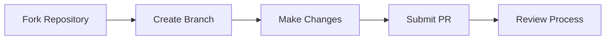

<div align="center">

# [](https://github.com/ElunaLuaEngine/Eluna)

*Unleash the power of Lua scripting in your AzerothCore server*

[](https://discord.com/invite/ZKSVREE7)
[](http://www.lua.org/manual/5.2/)
[](http://www.azerothcore.org/)

---
</div>

> [!NOTE]
> mod-eluna © is a powerful Lua scripting engine embedded into the AzerothCore emulator. We are committed to continuously improving mod-eluna for both developers and server administrators.

<details>
<summary>🎯 Table of Contents</summary>

- [Acknowledgements](#-acknowledgements)
- [Support & Resources](#-support--resources)
- [Installation](#-installation)
- [Documentation](#-eluna-documentation)
- [Useful Links](#-useful-links)
- [Community Additions](#%EF%B8%8F-community-additions)
- [Contributing](#-contributing)
</details>

## 🌟 Acknowledgements
<div align="center">

***Built on the shoulders of giants***
</div>

mod-eluna is a fork of the original [Eluna](https://github.com/ElunaLuaEngine/Eluna) project. We extend our heartfelt gratitude to the Eluna team for their work.

> **Explore More:**
> - [Original Github](https://github.com/ElunaLuaEngine/Eluna)
> - [Eluna Discord](https://discord.gg/bjkCVWqqfX)

## 💡 Support & Resources

### Need Help?
Feel free to open an issue for installation or scripting problems.

### Quick Links
- 📚 [mod-eluna API](https://www.azerothcore.org/eluna/)
- 📖 [Lua Reference](http://www.lua.org/manual/5.2/)

</div>

## ⚡ Installation

### Prerequisites
- AzerothCore installation
- Git
- CMake

### Quick Install
```bash
# Navigate to modules directory
cd modules

# Clone the repository
git clone https://github.com/azerothcore/mod-eluna.git

# Build using CMake
# You can choose your Lua version during cmake configuration using:
# -DLUA_VERSION={luajit, lua52, lua53, lua54}
# Example:
cmake ../ -DLUA_VERSION=luajit

# If no Lua version is specified, Lua 5.2 will be used by default

# Follow your normal build process
```

## 📚 Eluna Documentation
> [!WARNING]
> Please note that some mod-eluna functions may not be available on Eluna and vice versa.
- [Getting Started](https://github.com/ElunaLuaEngine/Eluna/blob/master/docs/USAGE.md)
- [Eluna Features](https://github.com/ElunaLuaEngine/Eluna/blob/master/docs/IMPL_DETAILS.md)

### AzerothCore
- [mod-eluna API](https://www.azerothcore.org/eluna/)
- [Hooks Documentation](https://github.com/azerothcore/mod-eluna/blob/master/src/LuaEngine/Hooks.h)

### Others emulators (TC, MaNGOS, CMaNGOS etc.)
- [Eluna API](https://elunaluaengine.github.io/index.html)
- [Hooks Documentation](https://github.com/ElunaLuaEngine/Eluna/blob/master/hooks/Hooks.h)

## 🔗 Useful Links
- [💻 Lua.org](http://www.lua.org/)
- [📜 License](https://github.com/azerothcore/mod-eluna/blob/master/LICENSE)

- [🎮 MaNGOS](https://www.getmangos.eu/)
- [🎮 cMaNGOS](https://cmangos.net/)
- [🎮 TrinityCore](https://www.trinitycore.org/)
- [🎮 AzerothCore](http://www.azerothcore.org/)

## 🛠️ Community Additions

> [!TIP]
> Our community has contributed numerous valuable features to enhance mod-eluna's capabilities.

<details>
<summary>Click to expand feature list</summary>

### Player Events
```lua
PLAYER_EVENT_ON_PET_ADDED_TO_WORLD
PLAYER_EVENT_ON_LEARN_SPELL
PLAYER_EVENT_ON_UPDATE_AREA
```

### Unit Methods
```lua
Unit:ModifyThreatPct()
Unit:GetAttackers()
Unit:SetSpeedRate(unitMoveType, speed)
```

### Miscellaneous Features
```lua
HttpRequest()
WorldDBQueryAsync
CharDBQueryAsync
AuthDBQueryAsync
```
</details>

> For a complete list of community contributions, check our [Community Updates](https://github.com/azerothcore/mod-eluna/blob/master/COMMUNITY_UPDATES.md).

## 🤝 Contributing

We welcome contributions! Here's how you can help:



<div align="center">

---
<sub>Made with ❤️ by the Eluna Community</sub>

[⬆ Back to Top](#)
</div>
