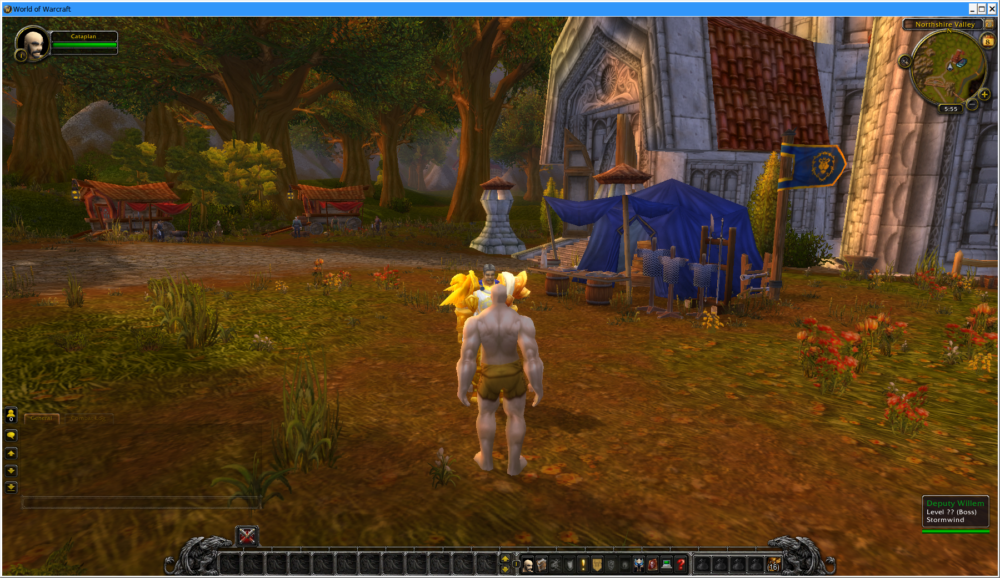

# Real-client automation: how the working design works

Reference for `run --auto-login` in `apps/cata/run_real_client_authentication.py`. This
describes focus acquisition and input delivery for the isolated client. Successful login and
character selection do not prove that the world loading screen has dismissed.

## Window discovery

`owned_wow_window()` scans `wmctrl -lpGx` for a window whose PID is in the generation's own
tracked wine PIDs **and** whose title is exactly `World of Warcraft`. Both halves matter:

- Matching on PID keeps the automation from ever driving a window this run does not own —
  including the user's own applications on the same display.
- The client is launched via a launcher process and re-execs, so the PID set is refreshed on
  every poll (`add_processes(... find_wine_processes(...))`) rather than captured once. A
  window that appears late, under a PID that did not exist at launch, is still recognised.

`focus_owned_window()` rediscovers the window and its live owned PIDs every 0.25s. Discovery
and activation share a 90s budget at startup and a 30s budget before later input. A replaced
window is rediscovered within the same attempt.

## Focus acquisition — the important part

**Do not use `XSetInputFocus`.** Measured live: an explicit `XSetInputFocus` that bypasses
the window manager's activation protocol — especially when repeated once per field click —
makes the client tear down its window and never recreate it. The most likely cause is DXVK
treating that as an unexpected focus-loss/gain pattern and resetting the device. This
manifested as the window simply vanishing mid-login, and it cost a lot of time to diagnose.

The working combination is:

1. Discover the current owned WoW window and read `_NET_ACTIVE_WINDOW` using `xprop`.
2. If it is not active, request activation with `wmctrl -i -a <window_id>`.
3. Continue polling until the same owned window stays active for at least 0.5s, or the
   shared deadline expires. All commands use the generation's `DISPLAY` and `XAUTHORITY`.

Verification is not optional. `wmctrl -a` is asynchronous and returns before the WM has actually
activated the window; without reading the property back, the automation races ahead and types
into whatever currently holds focus. Verifying through the WM's own bookkeeping is what makes
this deterministic.

## Driving the login — keyboard, not clicks

Once focus is verified, the login is driven **by keyboard** (`Tab`/`Return`) rather than by
clicking each field. Every click is a potential re-activation, and re-activating per field is
exactly the pattern that triggered the window teardown above. `client_login_points()` still
derives field coordinates as fractions of live window geometry (0.506 across; 0.536 / 0.623 /
0.752 down) so they survive a resized or repositioned window, but clicking is kept to the
minimum needed. Focus and geometry are reacquired after the movie wait, immediately before
the account-field click. The login path checks `_NET_ACTIVE_WINDOW` again before every mouse
or keyboard input and aborts if focus is lost. Character selection uses the same focus wait;
it no longer calls `XSetInputFocus` or relies on a one-second sleep after activation.

Keys are synthesised with `XTest` (`xtest.fake_input`), with `Shift_L` held for alphabetic
characters so the canonical uppercase synthetic credentials are entered correctly, and a 50ms
gap between characters. Coordinates are always computed from the window's *current* geometry
immediately before use, never cached from discovery time.

## Intro movie handling

A fresh Wine prefix boots into the 4.3.4 intro cinematic, which swallows input. The isolated
config sets both `movie` and `playIntroMovie` to `0`, but the automation still defends against
it: it tracks the owned `MovieProxy.exe` process and repeatedly sends `Escape` while that
process exists, with a 30s no-movie deadline and a 240s overall deadline. Credentials are only
entered once the movie is gone. Typing into the login UI while the cinematic is still active
was a real observed failure.

## Safety properties worth preserving

- **Never type without verified focus.** The focus check is a precondition, not a formality.
  An earlier ad-hoc harness typed blind and sent live credentials into an unrelated window on
  the same display. Anything driving real input must verify ownership immediately before each
  input burst, and abort rather than guess.
- **Only ever drive run-owned windows.** The PID-set check is the guard for this.
- **Prefer the WM's protocol over direct X calls.** See focus acquisition above.

## Evidence capture

Each run captures `window.xwd` (a raw X window dump) plus `window.xprop` into
`evidence/raw/`. The `.xwd` can be decoded without any external tool — parse the big-endian
header for width/height/`bytes_per_line`/`ncolors`, skip `header_size + ncolors * 12`, then
reorder BGRX to RGB.

### `window.xwd` does NOT contain the client's rendering — do not draw conclusions from it

**The pixels in `window.xwd` are not WoW's.** `xprop` correctly identifies the window (right
PID, `WM_NAME = World of Warcraft`, right 1800x1042 geometry) and the dump has that geometry,
but the *content* is whatever was in the screen framebuffer underneath — in practice one of
the user's terminals. The client renders through DXVK, and a Vulkan swapchain cannot be read
back by `XGetImage`/`xwd`; X has no backing store for it.

The proof is decisive and cost nothing to obtain:

```
md5sum generation-*/evidence/raw/window.xwd | awk '{print $1}' | sort | uniq -c | sort -rn
     28 fa666c87577c64e834f029c6135795a5
     20 f9775d8eaa52a354363c079dace7250b
```

28 runs produced *byte-identical* dumps, and another 20 produced a different byte-identical
dump — across generations whose outcomes ranged from auth failure to full world entry. A real
screenshot of a live 3D client cannot repeat byte-for-byte.

Consequences:

- Any earlier claim that the loading bar was measured at "90%" or "99%" from this file is an
  artifact. That framing is **not evidence-backed** and should not be used to direct
  debugging.
- Use the server log to establish protocol progress. It does not establish what the client
  rendered. Record direct visual confirmation separately; missing `CMSG_TIME_SYNC_RESP` alone
  does not prove the loading screen is still visible.
- A desktop screenshot can work even when `xwd` fails. On this desktop, `gnome-screenshot -w`
  captured the actual client after `focus_owned_window()` verified and activated its owned
  window. Run it with the generation's `DISPLAY` and `XAUTHORITY` immediately after that
  check; otherwise it captures whichever application is active. Native client screenshots
  are another option, but sending `Print` alone did not produce a file in these runs.

## Tools and settings a run depends on

Everything below is read out of `run_real_client_authentication.py`, not remembered. If a run
fails to even start, check this list before anything else — the failures it causes look like
unrelated client bugs.

### External binaries invoked

| Tool | Used for |
| --- | --- |
| `docker` | one MySQL container per generation (`acore-cata-plan13-<hash>-g<N>-mysql`) |
| `mysql` | schema creation, realmlist seeding, migration application |
| `wine` | launching the client through the GE-Proton runner |
| `wmctrl` | window discovery (`-lpGx`) and activation (`-i -a`) |
| `xprop` | reading `_NET_ACTIVE_WINDOW` back to verify focus |
| `xwd` | window dump into `evidence/raw/window.xwd` |

Automatic input requires the installed `python3-xlib` package for XTest keyboard and mouse
events. `xdotool` is not used.

### Wine environment

```
WINEPREFIX        = <generation>/wine-prefix   (isolated per generation, never the user's)
WINEARCH          = win64
WINEDLLOVERRIDES  = d3d9=n,b                   (native d3d9 -> DXVK)
WINEDEBUG         = +seh
DISPLAY           = :0                         (--display)
XAUTHORITY        = /home/trolloks/.Xauthority (--xauthority)
```

Runner: `--wine-runner /home/trolloks/.var/app/com.usebottles.bottles/data/bottles/runners/ge-proton11-1/files`.
DXVK comes from the personal bottle passed via `--personal-bottle`; the prefix is isolated but
seeded from it, so the bottle must still exist.

### Client configuration written by `prepare`

`WTF/Config.wtf` is rewritten wholesale:

```
SET locale "enUS"        SET realmlist "127.0.0.1"   SET patchlist "127.0.0.1"
SET readTOS "1"          SET readEULA "1"
SET movie "0"            SET playIntroMovie "0"      SET accounttype "CT"
SET gxWindow "1"         SET gxMaximize "0"
```

`gxWindow "1"` / `gxMaximize "0"` are load-bearing: a fullscreen or maximised client cannot be
activated reliably by `wmctrl`, and `window.xwd` of a fullscreen window is useless for
measuring the loading bar. `movie`/`playIntroMovie` are belt-and-braces alongside the
`MovieProxy.exe` Escape loop.

`Data/enUS/realmlist.wtf` is also written (`set realmlist 127.0.0.1`); the client reads
whichever it finds first, so both are set.

### Run parameters that matter

`--auto-login --stability-seconds 8 --timeout 110`. `--timeout` limits the observation loop
after automatic login. In post-marker modes, `--stability-seconds` is the hold time after the
mode's protocol marker. `observed` means the loop finished, including timeout; it does not
prove world entry. The `finally` block closes the owned client and servers even after a
successful run. For a longer interactive observation, increase both limits.

`--mode in-world-control-bootstrap` is the mode that seeds a character and drives it to world
entry, as opposed to the auth-only modes.

## The exact harness invocation

Recovering these arguments from scratch is slow and they are not stored anywhere the
`reset` command preserves (`generation.json` is removed by `reset`). Recorded here so a
future run does not have to reconstruct them:

```bash
cd /mnt/e1384d9e-bede-40dd-8b1c-be0beb488490/Fun/azerothcore-cata
M="/mnt/e1384d9e-bede-40dd-8b1c-be0beb488490/Fun/.plan11-runs/auth-15595/manifest.json"

# The binaries must report the current HEAD, so rebuild before every prepare.
cmake --build var/build-plan7 --target revision.h worldserver authserver -j "$(nproc)"

python3 apps/cata/run_real_client_authentication.py reset --manifest "$M"
python3 apps/cata/run_real_client_authentication.py prepare --manifest "$M" \
  --authserver  "$PWD/var/build-plan7/src/server/apps/authserver" \
  --worldserver "$PWD/var/build-plan7/src/server/apps/worldserver" \
  --unit-tests  "$PWD/var/build-plan7/src/test/unit_tests" \
  --client-root "/mnt/f79365ff-6a68-45da-925e-b9ddc6d5da6c/Blizzard Games/Battle.NET/drive_c/Games/Cataclysm-4.3.4.15595-enUS-x64" \
  --data-root   "/mnt/f79365ff-6a68-45da-925e-b9ddc6d5da6c/Fun/TrinityCore/TrinityCore/data" \
  --server-dbc-root "/mnt/f79365ff-6a68-45da-925e-b9ddc6d5da6c/Fun/node-dbc-reader/data/dbc" \
  --wine-runner "/home/trolloks/.var/app/com.usebottles.bottles/data/bottles/runners/ge-proton11-1/files" \
  --personal-bottle "/mnt/f79365ff-6a68-45da-925e-b9ddc6d5da6c/Blizzard Games/Battle.NET" \
  --migration "$PWD/data/sql/updates/pending_db_auth/rev_1786964293354831242.sql" \
  --display ":0" --xauthority "/home/trolloks/.Xauthority" \
  --mode in-world-control-bootstrap
python3 apps/cata/run_real_client_authentication.py run --manifest "$M" \
  --auto-login --stability-seconds 8 --timeout 110
```

`var/build-plan7` is the build tree the harness uses — not `var/build`, which is not
configured, nor `var/build-mysql-isolated`, which has no CMake cache.

## Retrying a failed run — do not reset and re-prepare

`run` accepts a generation already in `failed`/`inconclusive` state: it clears the raw
evidence and client `Logs`, flips the state back to `prepared`, and proceeds. So a run that
died on a transient environmental failure is retried by re-issuing the *same* `run` command
and nothing else.

`prepare` takes several minutes even with the database cache restored. Resetting and
re-preparing after a transient run failure throws that time away for no benefit.

### Fixed startup focus race, 2026-09-08

The old login path discovered one window and then allowed only five seconds for activation.
Generation 78 reproduced two focus failures before a third attempt passed. A traced run with
the fix measured a longer activation gap:

| Event | Seconds after run start |
| --- | ---: |
| Owned WoW window first discovered | 30.623 |
| WM still reports `_NET_ACTIVE_WINDOW = 0x0` | 36.126 |
| WM reports the owned window active | 36.527 |

That 5.904s gap exceeds the old deadline. The shared wait now covers discovery and stable
activation, so this delay is handled inside one attempt. Login also rechecks focus after
the movie wait; a focus check performed before that wait cannot authorize later typing.

Three consecutive runs with the fix authenticated and sent `CMSG_PLAYER_LOGIN` without a
focus failure. The third also confirmed that X input focus matched the owned window. None
sent `CMSG_TIME_SYNC_RESP`, so this evidence proves input delivery, not completed world
loading. These were retries of generation 78 using existing binaries, first with a 110s
observation period and then twice with 30s. Raw focus evidence is local at
`/tmp/cata-focus-trace.log` and is not a committed fixture.

Run the deterministic regression check with:

```bash
python3 apps/cata/test_real_client_focus.py
python3 apps/cata/run_real_client_authentication.py self-check
```

The focus check covers an eight-second activation delay, a replaced client window, correct
display propagation, an unrelated window remaining focused until timeout, and focus loss
between acquisition and input. No real input is sent by that check. If a real run exhausts
its new deadline, inspect the reported owned and active window IDs before retrying; never
bypass ownership or focus verification.

### Visually confirmed world entry with a diagnostic packet filter, 2026-09-08

The user confirmed "we were in!" during generation 78's `drop-extras` relay run with
`--auto-login --stability-seconds 8 --timeout 60`. The run ended in `observed` without a
recorded failure, and the harness cleaned up the client and servers. A repeat with both
limits set to 1800s confirmed world entry followed by a disconnect before the timer expired.
The client returned to login while the server remained running. World entry is visually
confirmed, but a stable session is not. The server log still contained no `CMSG_TIME_SYNC_RESP`.

The guide was the sibling `cata-js` implementation and its successful `server.log` packet
trace. A loopback relay filtered these server opcodes, which were absent from that reference
startup sequence:

```text
SMSG_POWER_UPDATE                 SMSG_CRITERIA_UPDATE
SMSG_MOVE_SET_ACTIVE_MOVER         SMSG_CONTACT_LIST
SMSG_SET_FORCED_REACTIONS          SMSG_AURA_UPDATE_ALL
SMSG_MOVE_UNSET_CAN_FLY            MSG_SET_DUNGEON_DIFFICULTY
SMSG_WEATHER                      SMSG_QUESTGIVER_STATUS_MULTIPLE
```

The relay preserved forwarded packet bodies and compression, and re-encrypted outgoing
headers to account for dropped packets. An earlier valid passthrough run reproduced the
failure to enter world. This filter was a diagnostic workaround. The final test below
isolated the aura-flag width and retained every outgoing packet. Do not remove all these
packets from the server as a permanent fix.

Local evidence is preserved in `/tmp/cata-success-drop-extras/`, including the user's
observation, relay packet decisions, and server/client logs. The diagnostic relay is
`/tmp/cata-login-proxy.py`; neither it nor those temporary artifacts are committed fixtures.
This comparison led to the narrowed correction below. Keep raw authentication logs out of
committed documentation.

### Disconnect after world entry: missing guild opcodes, 2026-09-08

The successful cata-js trace contains two startup requests missing from this fork's opcode
table. `WorldSocket::ReadDataHandler()` returns `Error` for an unregistered opcode, and its
caller closes the connection. The real client hit these consecutively:

| Request | Build 15595 opcode | Correction |
| --- | --- | --- |
| Guild-bank withdrawal limit | `0x1225` | Bind the existing guild query handler to the Cata request opcode |
| Guild achievement tracking | `0x1027` | Register as unhandled while guild achievement tracking remains unimplemented |

The withdrawal-limit response also has its own Cata opcode, `0x5DB4`, and an eight-byte
signed amount. The old bidirectional `0x03FE` definition and four-byte amount are WotLK layouts.
These values agree with cata-js and pinned TrinityCore commit
`c699217775d90794158422387b07a917e161b582`.

A relay test routed `0x1225` to the existing handler and ignored `0x1027`, with the outgoing
`drop-extras` filter retained. It produced a real screenshot of Cataplan in Northshire and
11 matched time-sync exchanges without an unknown-opcode disconnect. Evidence is local at
`/tmp/cata-success-guild-opcodes/`. Restoring all outgoing packets reproduced the loading
screen even with both incoming corrections. The guild fixes address the disconnect; the
outgoing aura-flag correction below completes the verified world-entry path.

Two debugger samples showed the world loop and map worker waiting normally, disproving the
earlier persistent-busy-loop hypothesis. In this environment, attaching GDB to an existing
server failed, but launching the owned binary as GDB's child worked without rebuilding.

### Resolved loading-screen hang: aura flags, 2026-09-08

`AuraApplication::BuildUpdatePacket()` wrote aura flags as `uint8`, but build 15595 reads
`uint16`. This shifted the caster level, stack count, and optional fields in every populated
NPC aura record. The shared writer now emits `uint16`, fixing both initial aura lists and
later aura updates. Pinned TrinityCore's `AuraDataInfo` serializer confirms the two-byte field.

The final real-client test corrected that exact width and the two guild requests in the
loopback relay. It retained every outgoing packet, including the previously filtered power,
flight, weather, difficulty, quest-status, and aura packets. It showed Cataplan and nearby
NPCs in Northshire, with 10 time-sync requests and 10 replies, no unknown-opcode disconnects,
and no relay errors. Seventy aura packets passed through the corrected serializer.



This is the stopping point for getting in-game. The C++ changes and a guild opcode/response
regression check are committed for the next build; no rebuild or new C++ test execution was
performed in this session. The live proof used existing binaries with the exact wire
corrections applied by the diagnostic relay. It does not satisfy Plan 13's separate
requirement for two fresh generations, and does not claim movement, combat, or quest support.
Local raw evidence and the relay are preserved in `/tmp/cata-success-aura-and-guild/`.

The focus regression check and runner self-check pass. SQL style checks pass. The C++ style
check reports only three pre-existing repeated blank lines in `UpdateFields.h`, also present
in the starting commit; the changed files introduce no reported style violations.

## Building before a run

`prepare` refuses binaries whose `--version` does not report the current HEAD, so a build is
required first. Two things about `var/build-plan7` that will otherwise cost time:

- Its CMake cache points `MYSQL_INCLUDE_DIR`/`MYSQL_LIBRARY` at `/tmp/mysql-dev`, a staging
  tree that does not survive a reboot. Repopulate it without root via
  `apt-get download libmysqlclient-dev libmysqlclient21` and `dpkg-deb -x` into
  `/tmp/mysql-dev`. MariaDB's headers (`/usr/include/mariadb`) are *not* a substitute — they
  lack `mysql_ssl_mode` and `mysql_stmt_bind_named_param`, and linking against them trips the
  `ACE00046` client/compile version assertion at startup.
- `mysql_com.h` includes `"mysql/udf_registration_types.h"`, so the include root needs a
  self-referential `mysql -> .` symlink inside it.

## Reading opcodes back out of a run

`GetOpcodeNameForLogging` emits a bracketed form, so grep for the bracket or you will get
no matches and wrongly conclude nothing was logged:

```bash
G=$(ls -d /mnt/e1384d9e-bede-40dd-8b1c-be0beb488490/Fun/.plan11-runs/auth-15595/generation-* | sort -V | tail -1)
grep -oE "\[(CMSG|MSG)_[A-Z_0-9]+" "$G/logs/WorldServer.log" | sort | uniq -c | sort -rn
```
